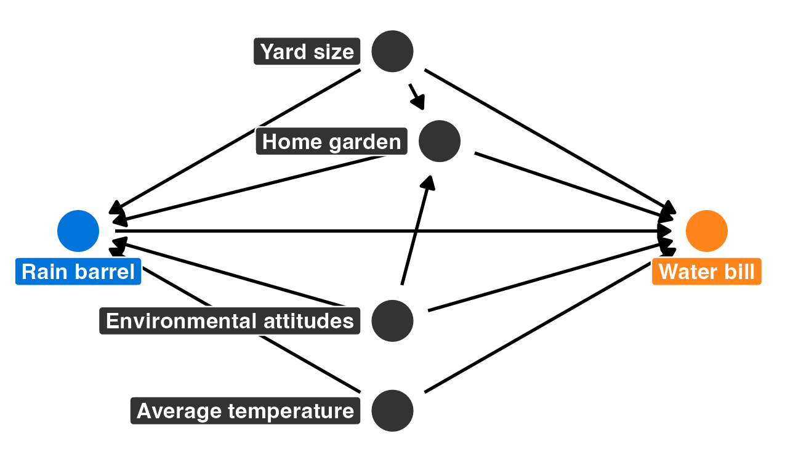
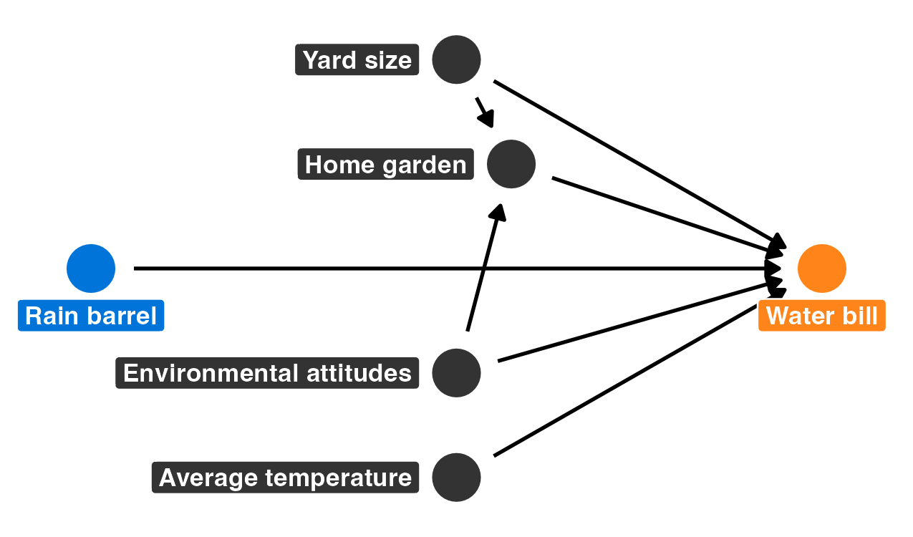

```{r}
#| label: setup
#| include: false

knitr::opts_chunk$set(
  fig.width = 6,
  fig.height = 6 * 0.618,
  fig.retina = 3,
  fig.align = "center",
  out.width = "80%"
)
```

# Program overview

::: {.callout-warning title="Fake data!"}
This isn't actually a real program or real data!
:::

The metropolitan Atlanta area is interested in helping residents become more environmentally conscious, reduce their water consumption, and save money on their monthly water bills. To do this, Fulton, DeKalb, Gwinnett, Cobb, and Clayton counties have jointly initiated a new program that provides free rain barrels to families who request them. These barrels collect rain water, and the reclaimed water can be used for non-potable purposes (like watering lawns and gardens). Officials hope that families that use the barrels will rely more on rain water and will subsequently use fewer county water resources, thus saving both the families and the counties money.

Being evaluation-minded, the counties hired an evaluator (you!) before rolling out their program. You convinced them to fund and run a randomized controlled trial (RCT) during 2024, and the counties rolled out the program city-wide in 2025. 

I have given you two datasets in `data/`: `barrels_rct.csv` with data from the RCT, and `barrels_obs.csv` with observational data from self-selected participants. These datasets contain the following variables:

| Variable          | Definition                                                         |
|:------------------|:-------------------------------------------------------------------|
| `id`              | A unique ID number for each household                              |
| `water_bill`      | The family's average monthly water bill, in dollars                |
| `barrel`          | An indicator variable showing if the family participated           |
| `barrel_num`      | A 0/1 numeric version of `barrel`                                  |
| `yard_size`       | The size of the family's yard, in square feet                      |
| `home_garden`     | An indicator variable showing if the family has a home garden      |
| `home_garden_num` | A 0/1 numeric version of `home_garden`                             |
| `attitude_env`    | The family's self-reported attitude toward the environment (1--10) |
| `temperature`     | The average outside temperature                                    |


# Your goal

Your task in this problem set is to analyze these two datasets to find the causal effect (or average treatment effect (ATE)) of this hypothetical program.

@fig-program-dag shows the full DAG for the rain barrel program. There are four confounders that complicate the relationship between barrel use and water bills.

{#fig-program-dag width="75%" fig-align="center"}

***Follow these two examples from class as guides:***

- [RCTs](https://evalsp26.classes.andrewheiss.com/example/rcts/)
- [Matching and IPW](https://evalsp26.classes.andrewheiss.com/example/matching-ipw/)

The code below loads the data. **You don't need to modify anything in this chunk of code---you only need to run it.**

```{r}
#| label: load-libraries-data
#| warning: false
#| message: false

library(tidyverse)
library(parameters)
library(marginaleffects)
library(patchwork)
library(MatchIt)
library(modelsummary)

barrels_rct <- read_csv("data/barrels_rct.csv") |> 
  # This makes it so "No barrel" is the reference category
  mutate(barrel = fct_relevel(barrel, "No barrel"))

barrels_obs <- read_csv("data/barrels_observational.csv") |> 
  # This makes it so "No barrel" is the reference category
  mutate(barrel = fct_relevel(barrel, "No barrel"))
```


# Task 1: Causal effects from an RCT

## Part 1: Modified DAG

You remember from PMAP 8521 that when running an RCT, you can draw the DAG for the program like @fig-rct-dag.

{#fig-rct-dag width="75%" fig-align="center"}

**Explain how @fig-rct-dag is different from @fig-program-dag and why it lets us identify the causal effect of the program.**

::: {.callout-tip title="Answer"}
When you have control over the assignment of treatment status, you get to remove all the arrows pointing into the treatment node in the DAG, since nothing else causes the treatment---it is completely exogenous now. This removes all backdoor confounding relationships between rain barrel use and water bill. Mathematically, we can write this effect using *do* notation: $E(\text{Water bill} \mid \operatorname{do}(\text{Rain barrel}))$.
:::

## Part 2: Balance

### Part 2a: Treatment assignment

Use `count()` and `mutate()` to recreate this table showing how many households were assigned to each group:

```{r}
#| label: recreate-me-treatment-balance
#| echo: false
#| ref.label: treatment-balance
```

::: {.callout-tip title="Answer"}

```{r}
#| label: treatment-balance

barrels_rct |>
  count(barrel) |>
  mutate(proportion = n / sum(n))
```

:::

**Discuss the sample size for the RCT data and how many people were assigned to treatment/control. Are you happy with this randomization?**

::: {.callout-tip title="Answer"}
55% of participants were in the program, which is slightly higher than a perfect 50%. We can check if that's a statistically significant difference by using a proportion test in R (this wasn't in the class materials, but it's helpful to know). 

The null hypothesis in a proportion test is that the proportion of two groups is the same, or 50%. Since there are only two groups (no barrel and barrel), R looks at just one and compares it to 50%. We made "No barrel" the first category when loading the data, so a proportion test will test whether the proportion of "No barrel" assignment is 50%:

```{r}
# table() finds a count of categories in barrels_rct$barrel; we then feed those
# counts into prop.test() to run the actual test

table(barrels_rct$barrel) |> 
  prop.test() |> 
  model_parameters(verbose = FALSE)
```

In a world where there's no difference between the proportions of the groups---or where the proportion of households assigned to the control group is ≈50%---there is a 2.4% chance of seeing a proportion at least as far from 50% as ≈45%. That is a significant difference (p = 0.024)! That means that there are likely fewer assigned to not get barrels than should have been. This is worth flagging, but it doesn't necessarily invalidate the results---the randomization may have been messed up a little.

We can also visualize the proportion of groups. Getting confidence intervals from proportion tests is a little tricky, since `prop.test()` only gives the results for one of the categories. Technically that's all we need when dealing with two numbers---if the proportion of treatment is 75%, the proportion of control has to be 25%. But when plotting, it can be helpful to include both groups.

So in @fig-visualize-treatment-difference we run `prop.test()` twice and extract the results and then plot them both simultaneously.
:::

```{r}
#| label: fig-visualize-treatment-difference
#| fig-cap: Difference in proportions of households assigned to treatment and outcome groups

all_proportions <- barrels_rct |>
  count(barrel) |>
  mutate(
    result = pmap(list(n, sum(n)), \(x, n) {
      broom::tidy(prop.test(x, n), conf.int = TRUE)
    })
  ) |>
  unnest(result)

ggplot(all_proportions, aes(x = barrel, y = estimate, color = barrel)) +
  geom_hline(yintercept = 0.5, color = "darkorange", alpha = 0.5) +
  geom_pointrange(aes(ymin = conf.low, ymax = conf.high)) +
  guides(color = "none") +
  scale_y_continuous(labels = scales::label_percent()) +
  coord_cartesian(ylim = c(0.35, 0.65)) +
  labs(x = NULL, y = "Proportion")
```



### Part 2b: Pre-treatment characteristics

Technically, as long as randomization was done correctly, we don't need to worry that much about covariate balance. Not every pre-treatment characteristic needs to be perfectly equal across treatment and control groups. It's still a good idea to check for general balance, though, just in case there was a failure in randomization (i.e. if only people with big yards were assigned to treatment).

**Are the four pre-treatment confounders balanced across treatment and control groups? Are you happy with this balance?**

::: {.callout-tip title="Answer"}
Participants' pre-treatment characteristics appear fairly well balanced. It seems that people in the control group are more likely to have a garden, have a larger yard, and have higher regard for the environment, but these differences aren't statistically significant.

```{r}
#| label: check-pretreatment-balance

barrels_rct |>
  group_by(barrel) |>
  summarize(
    prop_garden = mean(home_garden_num),
    avg_yard_size = mean(yard_size),
    avg_env = mean(attitude_env),
    avg_temp = mean(temperature)
  )
```

:::

::: {.callout-tip title="Bonus answer"}

We can more formally test these differences with some *t*-tests.

There's no statistically significant difference between home garden use between the two groups (p = 0.115):

```{r}
#| label: test-garden

t.test(home_garden_num ~ barrel, data = barrels_rct) |> 
  model_parameters(verbose = FALSE)
```

There's also no difference in average yard size (p = 0.217):

```{r}
#| label: test-yard

t.test(yard_size ~ barrel, data = barrels_rct) |>
  model_parameters(verbose = FALSE)
```

:::

::: {.callout-tip title="Bonus answer continued"}
There's also no difference in attitudes towards the environment (p = 0.584):

```{r}
#| label: test-attitude

t.test(attitude_env ~ barrel, data = barrels_rct) |> 
  model_parameters(verbose = FALSE)
```

And finally, there's no difference in average temperature (p = 0.702):

```{r}
#| label: test-temperature

t.test(temperature ~ barrel, data = barrels_rct) |>
  model_parameters(verbose = FALSE)
```

@fig-pretreatment-balance visualizes these differences. All the confidence intervals overlap and nothing looks too out of the ordinary.

:::

```{r}
#| label: fig-pretreatment-balance
#| fig-cap: Average values of pre-treatment confounders across treatment and control groups
#| fig-width: 8
#| fig-height: 6
#| out-width: 100%

p_garden <- ggplot(
  barrels_rct,
  aes(x = barrel, y = home_garden_num, color = barrel)
) +
  stat_summary(
    geom = "pointrange",
    fun.data = "mean_se",
    fun.args = list(mult = 1.96)
  ) +
  scale_y_continuous(labels = scales::label_percent()) +
  guides(color = "none") +
  labs(x = NULL, y = "Proportion with a garden")

p_yard <- ggplot(
  barrels_rct,
  aes(x = barrel, y = yard_size, color = barrel)
) +
  stat_summary(
    geom = "pointrange",
    fun.data = "mean_se",
    fun.args = list(mult = 1.96)
  ) +
  scale_y_continuous(labels = scales::label_comma()) +
  guides(color = "none") +
  labs(x = NULL, y = "Yard size (sq ft)")

p_env <- ggplot(
  barrels_rct,
  aes(x = barrel, y = attitude_env, color = barrel)
) +
  stat_summary(
    geom = "pointrange",
    fun.data = "mean_se",
    fun.args = list(mult = 1.96)
  ) +
  guides(color = "none") +
  labs(x = NULL, y = "Attitude toward environment")

p_temp <- ggplot(
  barrels_rct,
  aes(x = barrel, y = temperature, color = barrel)
) +
  stat_summary(
    geom = "pointrange",
    fun.data = "mean_se",
    fun.args = list(mult = 1.96)
  ) +
  scale_y_continuous(labels = scales::label_number(suffix = "°")) +
  guides(color = "none") +
  labs(x = NULL, y = "Temperature")

(p_garden + p_yard) / (p_env + p_temp)
```


## Part 3: Estimating the effect

With a properly randomized RCT, we can estimate the causal effect with a simple regression. Use `lm()` and `model_parameters()` to recreate this output:

```{r}
#| label: recreate-me-rct-ate
#| echo: false
#| ref.label: rct-ate
```

::: {.callout-tip title="Answer"}

```{r}
#| label: rct-ate

model_rct <- lm(water_bill ~ barrel, data = barrels_rct)
model_parameters(model_rct, verbose = FALSE)
```

:::

**What is the average causal effect of the rain barrel program on monthly water bills? Is it statistically significant? How credible do you find this estimate?**

::: {.callout-tip title="Answer"}
The coefficient for `barrelBarrel` is −40.57, meaning the program *causes* monthly water bills to fall by about $40, on average. This is highly statistically significant (p < 0.001). Since this comes from a randomized experiment with reasonable balance across pre-treatment characteristics, this estimate is fairly credible. The main caveat is the slight imbalance in treatment assignment (45% vs. 55%), but that's unlikely to substantially bias the result.
:::


# Task 2: Causal effects from observational data

RCTs are expensive and not always feasible. In this task, you'll use the larger observational dataset (`barrels_obs`) to try to recover a similar causal estimate using matching and inverse probability weighting.

## Part 1: Naive difference in means

As a baseline, use `lm()` to calculate the average difference in water bills for those in the program and those not in the program *using the observational data* (`barrels_obs`).

**How does this naive estimate compare to the RCT estimate from Task 1? Is it the same? Why or why not? Should you trust it?**

::: {.callout-tip title="Answer"}

```{r}
#| label: naive-diff

# With group_by() and summarize()
barrels_obs |>
  group_by(barrel) |>
  summarize(n = n(), avg_bill = mean(water_bill)) |> 
  mutate(difference = avg_bill - lag(avg_bill))

# With regression
model_naive <- lm(water_bill ~ barrel, data = barrels_obs)
model_parameters(model_naive, verbose = FALSE)
```

The naive estimate is about −$30, which is smaller in magnitude than the RCT estimate of −$40. This is because participants self-selected into the program: families who choose to use rain barrels are probably already more environmentally conscious, may have different yard sizes, and differ from non-participants in other ways that independently influence water usage. These confounders bias the naive estimate downward. This estimate is wrong and we probably shouldn't trust it.
:::


## Part 2: Matching

Because participants self-selected into the program, the four confounders in @fig-program-dag (`yard_size`, `home_garden`, `attitude_env`, and `temperature`) open backdoor paths between barrel use and water bills. Use Mahalanobis nearest-neighbor matching to close them.

::: {.callout-tip title="Answer"}

```{r}
#| label: matching

matched <- matchit(
  barrel_num ~ yard_size + attitude_env + home_garden_num + temperature,
  data = barrels_obs,
  method = "nearest",
  distance = "mahalanobis",
  replace = TRUE
)

# If you want to see the details:
# summary(matched)

# If you only want to see the sample sizes
summary(matched)$nn
```

All 505 barrel users were paired with 300 non-barrel users, so we'll discard 436 non-barrel users that don't match well. We use this matched data in a new regression model:

```{r}
#| label: matching-ate

barrels_matched <- match_data(matched)

model_matched <- lm(
  water_bill ~ barrel,
  data = barrels_matched,
  weights = weights
)
model_parameters(model_matched, verbose = FALSE)
```

:::

**What is the matching-based ATE? How does it compare to the naive estimate and the RCT estimate?**

::: {.callout-tip title="Answer"}
Matching has reduced confounding by pairing barrel users with similar non-users, and using the weights corrects for the unequal reuse of matched controls. The weighted matching ATE is about −$39, which is substantially closer to the RCT estimate of −$40 than the naive −$30.
:::


## Part 3: Inverse probability weighting

Now estimate the same causal effect using inverse probability weighting (IPW).

::: {.callout-tip title="Answer"}

```{r}
#| label: ipw-propensity

wants_barrel_model <- glm(
  barrel ~ yard_size + attitude_env + home_garden + temperature,
  data = barrels_obs,
  family = binomial(link = "logit")
)

barrel_propensities <- predictions(wants_barrel_model, barrels_obs) |>
  rename(p_barrel = estimate)

barrels_ipw <- barrel_propensities |>
  mutate(
    ipw = (barrel_num / p_barrel) + ((1 - barrel_num) / (1 - p_barrel))
  )

model_ipw <- lm(water_bill ~ barrel, data = barrels_ipw, weights = ipw)
model_parameters(model_ipw, verbose = FALSE)
```

:::

::: {.callout-tip title="Bonus answer"}

Alternatively, you can do this all more automatically with the {WeightIt} package. This is technically more accurate because it makes appropriate adjustments to the standard errors.

```{r}
#| message: false
library(WeightIt)

weights_auto <- weightit(
  barrel ~ yard_size + attitude_env + home_garden + temperature,
  data = barrels_obs,
  method = "glm",
  estimand = "ATE"
)

model_ipw_auto <- lm_weightit(
  water_bill ~ barrel,
  data = barrels_obs,
  weightit = weights_auto
)

model_parameters(model_ipw_auto, verbose = FALSE)
```

:::


**What is the IPW-based ATE? How does it compare to the matching estimate and the RCT estimate?**

::: {.callout-tip title="Answer"}
After using inverse probability weighting, the observational ATE for the rain barrel program is −$39.05, which is again much closer to \$40 than the naive estimate. By upweighting "weird" observations that look like they should have been in the other group (given their confounders), IPW creates a pseudo-population where barrel use is independent of the confounders, kind of simulating the idea random assignment.
:::


# Task 3: Comparing all results

Put your four ATE estimates (RCT, naive, matching, and IPW) in one side-by-side regression table using `modelsummary()`. Make it clean and polished---use nicer coefficient names, relevant goodness-of-fit statistics, an informative caption, and a cross-referenceable label.

```{r}
#| label: tbl-all-ates
#| tbl-cap: ATE estimates from RCT, naive regression, matching, and IPW

gm <- tibble::tribble(
  ~raw        , ~clean , ~fmt ,
  "nobs"      , "N"    ,    0 ,
  "r.squared" , "R^2^" ,    2
)

modelsummary(
  list(
    "RCT" = model_rct,
    "Naive" = model_naive,
    "Matching" = model_matched,
    "IPW" = model_ipw
  ),
  coef_map = c("barrelBarrel" = "Rain barrel program"),
  gof_map = gm,
  stars = TRUE,
  fmt = 2
) |> 
  tinytable::format_tt(i = 4, j = 1, markdown = TRUE)
```



**Which estimate do you trust most, and why? Would the observational estimates alone be enough to justify rolling this program out statewide? What are the strengths and limitations of each approach?**

::: {.callout-tip title="Answer"}
Of all the estimates in @tbl-all-ates, the RCT ATE (−$40) is the most credible. Random assignment eliminates selection bias and closes all backdoor paths by design, so we can be confident the difference in water bills is caused by the program rather than by pre-existing differences between participants and non-participants. The slight imbalance in group size is worth noting but is unlikely to substantially distort the result.

If we had to rely on the observational data alone, both the weighted matching estimate (−$39) and the IPW estimate (also −$39) would be defensible, since they each attempt to close the four backdoor paths identified in the DAG. The naive estimate (−$30) should not be used for causal inference because it confounds the program effect with self-selection. The fact that both observational methods converge near the RCT benchmark is reassuring---it suggests the DAG is well-specified and the important confounders are measured. (Which makes sense because this is synthetic data and I created it using only those confounders!)

Each of these ATEs is statistically significant and fairly substantive—saving ≈\$40 a month on my water bill would be great! Given these findings, it might be worth rolling this program out statewide (though a cost-benefit analysis would probably be necessary).

The main limitation of both of these observational approaches is unobserved confounding. If households that adopt barrels differ from non-adopters in ways we didn't measure (e.g., income, general water-use habits), our estimates would still be biased and wrong.
:::
